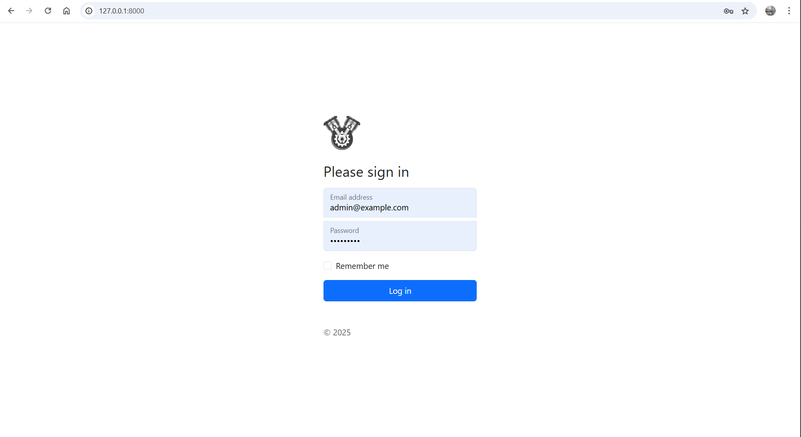
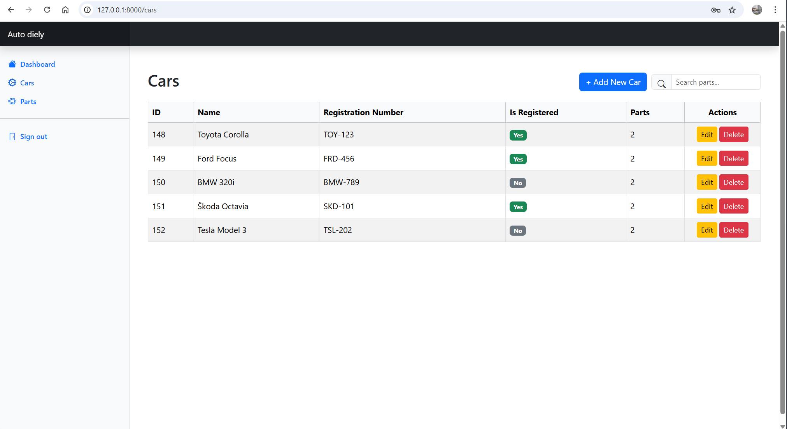
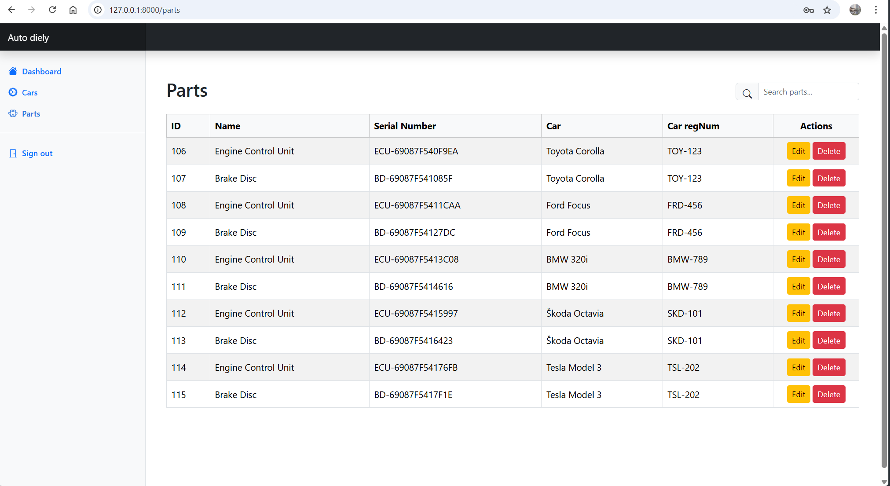
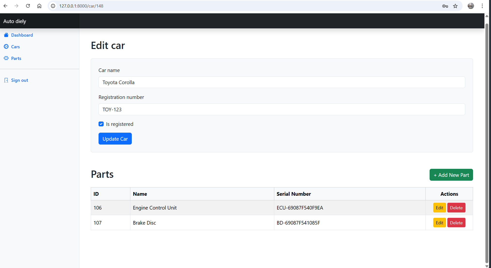
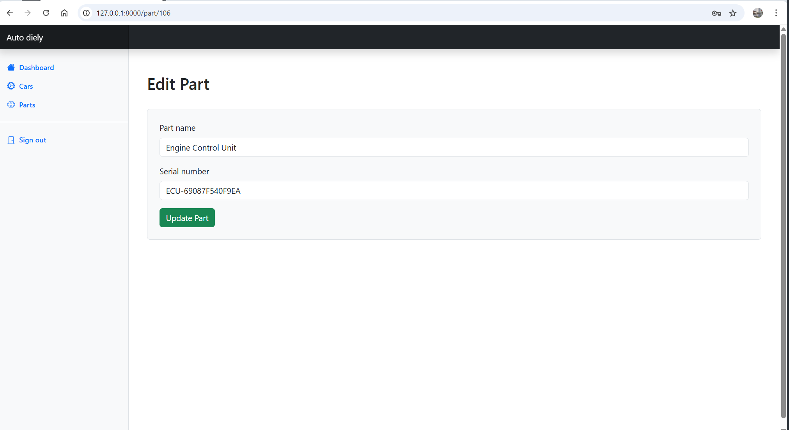
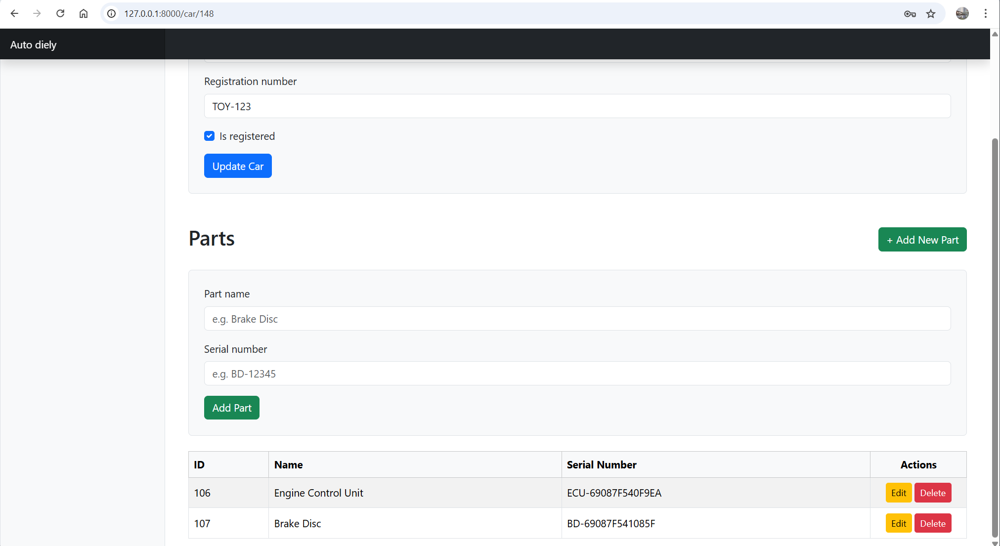
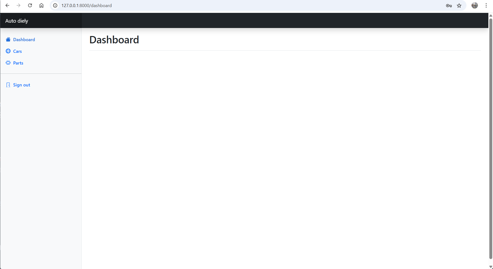

# Car parts

Demo application for a technical interview: a simple car and parts inventory system.

## Overview

"Car parts" is a small demo app to track cars and their parts. It includes user authentication, a list of cars, and a list arts (each part belongs to a car). Intended as a portfolio / interview demo.

## Features


- Login / Authentication
- List, create, edit and delete Cars
- List, create, edit and delete Parts (linked to Cars)
- Simple responsive UI built with Bootstrap
- Runs in Docker containers with a MySQL database

## Tech stack

- Backend: Laravel (PHP) Laravel Version  12.36.1
- PHP Version  8.4.1
- Frontend: Vue.js
- Styling: Bootstrap
- Database: MySQL
- Dev / runtime: Docker / Docker Compose

## Requirements

- Docker & Docker Compose

## Quick setup (Docker)

0. starting the application 

```bash

./run.sh

```

using the ./run.sh script, which builds the containers, installs Composer and npm dependencies, and builds the application in a single step. Then open application in browser.

```text

	[http://localhost:8000](http://localhost:8000)

```


1. Clone the repository

```bash

git clone <repo-url>

cd auto-diely

```


2. Copy environment file


```bash

cp .env.example .env

# edit .env if needed (DB credentials are set for Docker Compose by default)

```


3. Start containers


```bash

docker compose up -d --build

```


4. Install dependencies and run migrations (inside app container)


```bash

# run commands inside the php/app container, for example:

docker exec -it laravel_app /bin/bash
cp .env.example .env
php artisan key:generate
composer install
php artisan migrate --seed
npm install
npm run build

# or run old above with this install commands:

docker exec -it laravel_app /var/www/install.sh

exit

```


5. Open the app in your browser


```text

[http://localhost:8000](http://localhost:8000)

```

6. CLEANING removing containers and cleaning up is done using the clean.sh script.

```bash
./clean.sh
```

## Environment / Database


The app uses MySQL. Default Docker Compose sets the following environment variables (adjust in .env or docker-compose.yml eeded):


- DB_CONNECTION=mysql

- DB_HOST=mysql

- DB_PORT=3306

- DB_DATABASE=laravel

- DB_USERNAME=laravel

- DB_PASSWORD=secret


## Project structure (high level)


- `app/` — Laravel backend code (models, controllers)

- `resources/js/` — Vue frontend components

- `resources/sass` or `resources/css` — Bootstrap styles and overrides

- `database/` — migrations and seeders

- `docker-compose.yml` — container setup


## Screenshots


*Placeholders — replace with your screenshots in the repo when ready:*


<p align="center">
  
  
  
  
  
  
  
</p>


## Common commands


- Build & start containers: `docker compose up -d --build`

- Stop containers: `docker compose down`

- Run artisan inside container: `docker compose exec laravel_app php artisan <cmd>`

- Run npm inside container: `docker compose exec laravel_app npm run build`


## Notes for interview/demo


- This is intentionally small and focused — highlight authentication flow, Eloquent relationships (Car -> Parts)

- Point out the Docker setup that makes the app easy to run locally.


## Contributing


Feel free to open issues or submit pull requests. For small changes, follow this flow:


1. Fork the repo

2. Create a feature branch

3. Commit changes and push

4. Open a pull request describing the change


## License


GNU General Public License v3.0
